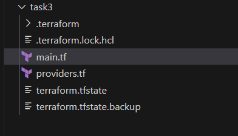
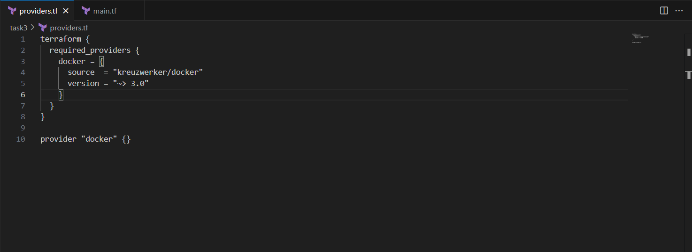
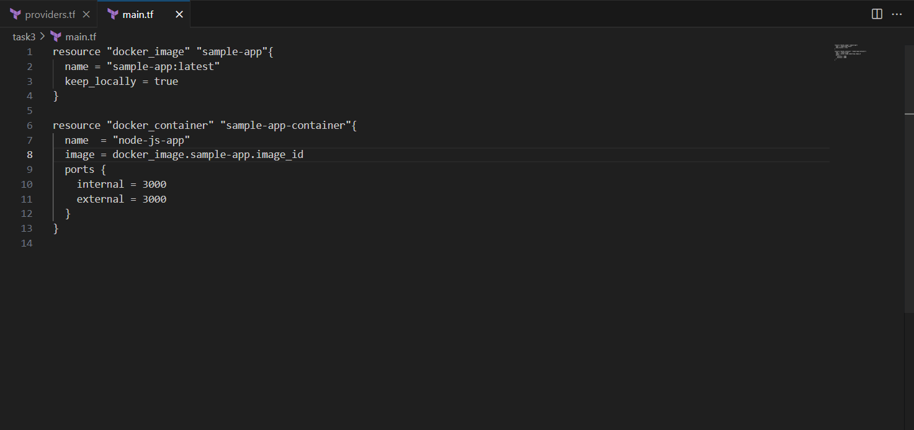
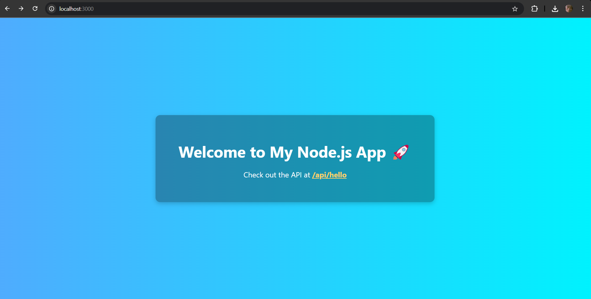
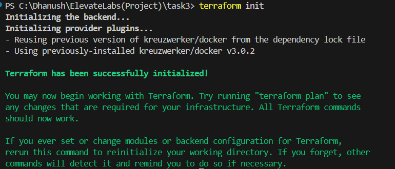
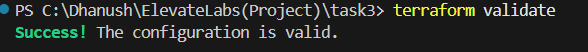
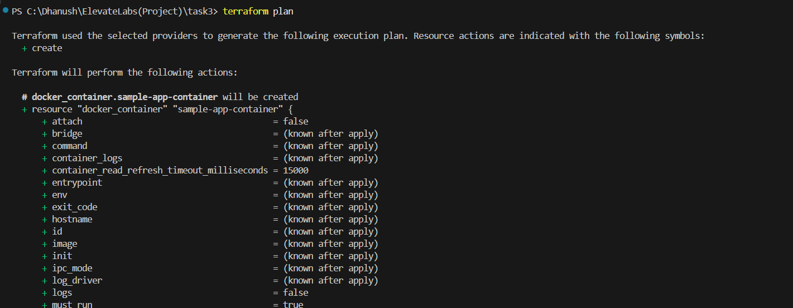
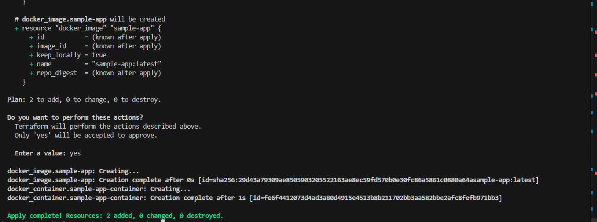
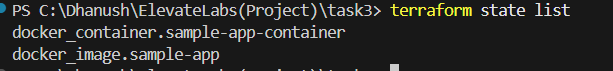
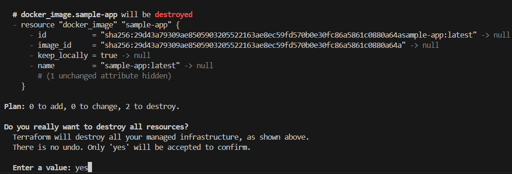

# 🌍 Terraform Docker Container Provisioning

This project demonstrates how to use **Terraform** to provision and manage a **Docker container** locally using **Infrastructure as Code (IaC)** principles.

---

## 🚀 Objective

Provision a Docker container using Terraform on your local machine.

---

## 🛠️ Tools & Tech Stack

- **Terraform** – IaC tool for automating infrastructure
- **Docker** – Containerization platform
- **Local system** (Linux/macOS/Windows with Docker & Terraform installed)

---

## 📁 Project Structure



## 🔧 Prerequisites

- [Terraform Installed](https://developer.hashicorp.com/terraform/downloads)
- [Docker Installed & Running](https://docs.docker.com/get-docker/)
- Docker daemon must be running locally

---

## 🖼️ Tf files Screenshots





## 🚀 How to Run


### ✅ Initialize Terraform

```bash
terraform init
```




### 🔍 Validate Configuration

```bash
terraform validate
```
Checks the syntax and structure of your Terraform configuration files.



🔍 Check What Will Be Created
```bash
terraform plan
```
Previews the infrastructure that Terraform will create or modify.



⚙️ Apply & Provision Infrastructure

```bash
terraform apply
```
Applies the Terraform configuration to create the container. Confirm with yes when prompted.



⚙️ State List

```bash
terraform state list
```



🌐 Access the App
After provisioning is complete, you can access the app from your browser at:

```bash
http://localhost:3000
```
This is a running nginx container exposed on port 8080.


🧼 Destroy Infrastructure

```bash
terraform destroy
```



Tears down the container and cleans up resources. Confirm with yes when prompted.


> 💡 Made with ❤️ using Terraform and Docker by Dhanush Nadar!
